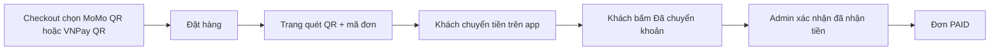

# Hướng dẫn thanh toán QR MoMo / VNPay **cá nhân** (đồ án tốt nghiệp)

> **Vì sao dùng QR cá nhân?**  
> API merchant VNPay/MoMo cần **tài khoản doanh nghiệp** và hợp đồng. Với **ví/ngân hàng cá nhân**, bạn chỉ có **mã QR tĩnh** — khách quét, nhập đúng số tiền + nội dung chuyển khoản, shop **xác nhận thủ công**. Cách này phù hợp báo cáo: mô tả rõ luồng, demo được tiền thật vào ví bạn.

---

## Bước 1 — Lấy mã QR từ điện thoại

### MoMo cá nhân

1. Mở app **MoMo** → **Nhận tiền** / **QR của tôi**.
2. Chụp màn hình hoặc tải ảnh QR (nên dùng ảnh **chỉ có mã QR**, nền trắng).
3. Lưu file với tên **`momo-qr.png`**.

### VNPay / VietQR (ngân hàng cá nhân)

1. Mở app **ngân hàng** (VCB, TCB, …) → **VietQR** / **QR nhận tiền**  
   *(Nhiều sinh viên gọi chung là "VNPay" — thực tế là QR liên kết ngân hàng.)*
2. Lưu ảnh QR với tên **`vnpay-qr.png`**.

---

## QR động (khuyến nghị)

### MoMo — quan trọng

QR MoMo **không dùng số điện thoại** `0973407934` làm STK. Ví MoMo nhận qua **BVBank (970454)** với **STK riêng** (trên app hiển thị dạng `*******219`).

**Lấy STK đầy đủ:**

1. MoMo → **Nhận tiền**
2. Chạm dòng **STK: \*\*\*\*\*\*\*219**
3. **Sao chép** số tài khoản đầy đủ (thường bắt đầu `99MM...` hoặc chuỗi dài)
4. Dán vào **cả hai** file (phải giống nhau):

```properties
# backend/canim_ecommerce/src/main/resources/application.properties
payment.personal-qr.momo.wallet-account-number=99MMxxxxxxxx219
```

```ts
// frontend/src/config/payment-qr.config.ts
momo: { walletAccountNumber: "99MMxxxxxxxx219", phone: "0973407934", ... }
```

> **Lỗi thường gặp:** dán mã dạng `PSP2614917100000219` — đây **không** phải STK ví MoMo → QR tạo ra quét được nhưng **không chuyển tiền**. Chỉ dùng STK sao chép từ app (thường bắt đầu `99MM`).

5. Restart backend, F5 trang thanh toán

Hệ thống tạo QR EMV chuẩn MoMo (có **số tiền đơn** + **mã đơn**), render trên web bằng `vietnam-qr-pay`.

### Chuyển khoản ngân hàng (VNPAY_QR)

Dùng STK ngân hàng thật + mã `970436` (VCB) — QR qua `img.vietqr.io`.

## Bước 2 — Cấu hình tài khoản nhận tiền (bắt buộc)

| Việc | File |
|------|------|
| **MoMo — tên, SĐT, mã NAPAS** | `frontend/src/config/payment-qr.config.ts` **và** `backend/.../application.properties` |
| **Ngân hàng — STK, tên NH, mã NAPAS** | Cùng các file trên (`vnpay.accountNumber`, `vietqrAcquirerId`) |

Mã NAPAS thường dùng: **Vietcombank `970436`**, **MoMo `971025`**. Nếu QR không quét được, tra lại trên [vietqr.net](https://vietqr.net).

### Ảnh QR tĩnh (tùy chọn, dự phòng)

| File | Đường dẫn |
|------|-----------|
| MoMo | `frontend/public/qr/momo-qr.png` |
| Ngân hàng | `frontend/public/qr/vnpay-qr.png` |

---

## Bước 3 — Sửa tên / SĐT hiển thị (frontend)

Mở file:

**`frontend/src/config/payment-qr.config.ts`**

Sửa `momo.accountName`, `momo.phone`, `vnpay.accountName`, `vnpay.bankName`, `vnpay.accountNumber` cho khớp tài khoản của bạn.

*(File này dùng khi cần hiển thị offline; API backend cũng có bản tương ứng ở bước 4.)*

---

## Bước 4 — Sửa thông tin trên backend (tùy chọn, khuyến nghị)

1. Mở **`backend/canim_ecommerce/src/main/resources/application.properties`**  
   **hoặc** copy nội dung từ  
   **`backend/canim_ecommerce/src/main/resources/application-qr-personal.example.properties`**

2. Sửa các dòng:

```properties
payment.personal-qr.momo.account-name=Họ tên trên MoMo
payment.personal-qr.momo.phone=09xxxxxxxx
payment.personal-qr.vnpay.account-name=HỌ TÊN IN HOA
payment.personal-qr.vnpay.bank-name=Vietcombank
payment.personal-qr.vnpay.account-number=0123456789
```

3. **Chạy migration** (lần đầu sau khi pull code mới): khởi động backend → Flyway chạy `V16__add_personal_qr_payment_methods.sql`.

4. Restart backend (port `8000`).

---

## Bước 5 — Luồng demo trên website



1. Đăng nhập → giỏ hàng → **Thanh toán**.
2. Chọn **MoMo — quét QR cá nhân** hoặc **VNPay/VietQR — quét QR cá nhân**.
3. Đặt hàng → trang **`/orders/{id}/qr-pay`**:
   - Hiện ảnh QR, số tiền, **mã đơn** (nội dung chuyển khoản).
4. Trên điện thoại: quét QR → nhập **đúng số tiền** → nội dung: **mã đơn** (ví dụ `ORD-20260529120000-1234`).
5. Bấm **「Tôi đã chuyển khoản」**.
6. **Admin** xác nhận (Swagger hoặc Postman):

```http
PATCH http://localhost:8000/canim_ecommerce/orders/{orderId}/confirm-qr-payment
Authorization: Bearer <token_admin>
```

---

## Bước 6 — Ghi vào báo cáo đồ án (gợi ý)

| Nội dung | Cách trình bày |
|----------|----------------|
| Hạn chế API merchant | Cá nhân không có IPN tự động → dùng QR tĩnh + xác nhận thủ công |
| Use case | `MOMO_QR`, `VNPAY_QR` trong enum `PaymentMethod` |
| Sequence diagram | Khách → Web → QR → App ngân hàng → Admin xác nhận |
| So sánh | Cổng `VNPAY`/`MOMO` (sandbox merchant) vs `*_QR` (cá nhân) |

---

## Câu hỏi thường gặp

**Có tự động nhận tiền như Shopee không?**  
Không, trừ khi đăng ký merchant và tích hợp IPN (phần `VNPAY`/`MOMO` sandbox trong project).

**Tiền về đâu?**  
Về ví MoMo / tài khoản ngân hàng gắn với mã QR bạn đã tạo.

**Hội đồng hỏi sao không dùng API?**  
Trả lời: phạm vi đồ án + tài khoản cá nhân; hệ thống vẫn quản lý đơn, trạng thái `UNPAID → PAID` khi admin đối soát — mô phỏng quy trình thực tế shop nhỏ.

---

## File cần nhớ (tóm tắt)

| File | Mục đích |
|------|----------|
| `frontend/public/qr/momo-qr.png` | Ảnh QR MoMo |
| `frontend/public/qr/vnpay-qr.png` | Ảnh QR ngân hàng/VietQR |
| `frontend/src/config/payment-qr.config.ts` | Tên, SĐT, STK hiển thị |
| `backend/.../application-qr-personal.example.properties` | Mẫu cấu hình backend |
| `backend/.../application.properties` | Cấu hình thật khi chạy server |
